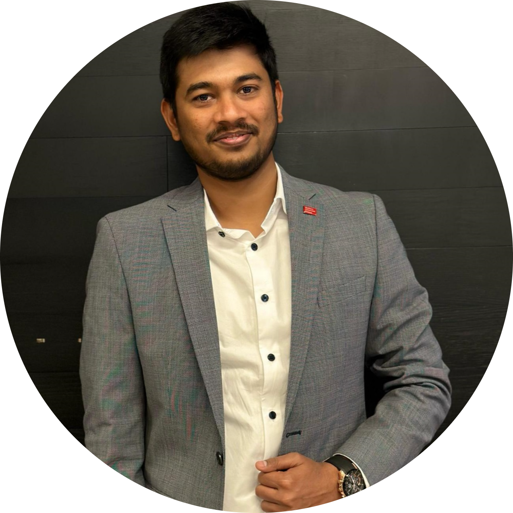

# Kuladeep Karimpati - Data Engineer

Welcome to my professional portfolio! I'm Kuladeep Karimpati, a Data Engineer with a passion for leveraging technology to drive innovative solutions. This README provides an overview of my education, skills, career profile, experiences, and more.

## Table of Contents
- [Profile Information](#profile-information)
- [Career Profile](#career-profile)
- [Skills](#skills)
- [Experiences](#experiences)
- [Education](#education)
- [Languages](#languages)
- [Interests](#interests)

## Profile Information
- **Name:** Kuladeep Karimpati
- **Tagline:** Data Engineer
  

## Career Profile
As a versatile professional, I specialize in data analysis, software development, and ETL development. My key skills include Python, SQL, ETL tools, and cross-functional collaboration. I have a proven track record of delivering innovative solutions, including the construction of chatbots and BIM dashboards.

## Skills
### Programming
- Python, SQL, Vanilla.js & Node.js (basics)

### Databases
- SQL Server, Data lake

### Cloud, ETL
- Azure Data Factory, Databricks, SAP BW

### Data Analysis
- MS PowerBI

### RESTful API
- OpenAI, Autodesk Forge API

### Others
- MS SSIS, QGIS, Autodesk Revit, Unreal Engine 4, MS Office

### Soft Skills
- Critical thinking, Problem solving, Teamwork, Communication, Time management, Adaptability, Creativity, Leadership, Empathy, Decision making, Stress management, Self-motivation

## Experiences
### Data Analyst | BIM Technician
- **Time:** 07/2022 - Present
- **Company:** EDD-Holding, Köln
- **Technologies:**
  - Python, Pyspark, Vanilla.js, Node.js, RESTful API, SQL, PowerBI, Databricks
- **Details:**
  - Developed a solution architecture for BIM Dashboards involving ETL processes and PowerBI on MS Azure
  - Conducted ETL operations on building data and prepared PowerBI Dashboards for comprehensive reinforcement, concrete, and CO2 assessments
  - Implemented Autodesk Forge-based web applications, including an IFC cloud converter and a data extractor into Excel
  - Created and deployed a construction chatbot using OpenAI embeddings and Python Flask
  - Developed Revit Dynamo scripts for parametric updates and integrated FRILO applications with Revit Dynamo and SOFiSTiK using Python

### ETL Developer - Internship
- **Time:** 05/2021 – 09/2021
- **Company:** Hochtief Vicon GmbH, Essen
- **Technologies:**
  - SQL, ETL, Azure DF, PowerShell, MS SSIS
- **Details:**
  - Implemented a recursive file search using Azure Data Factory
  - Optimized an existing Azure Data Factory ETL pipeline through generalization
  - Implemented multiple connectors in a data processing workflow MS SSIS and T-SQL
  - Various software developments and adjustments in C# and PowerShell

### ETL Developer
- **Time:** 07/2017 – 09/2019
- **Company:** Tata Consultancy Services Ltd., Hyderabad, India
- **Technologies:**
  - SQL, ETL, Informatica ETL, SAP BW
- **Details:**
  - Designed and developed SQL database schemas, and optimized data storage structures for efficient loading and retrieval of data
  - Implemented robust ETL pipelines using Informatica ETL, enabling seamless data integration from various sources into a central database for advanced reporting
  - Collaborated with cross-functional teams to determine data migration requirements, executed migration plans, and verified data quality post-migration
  - Monitored data loads and addressed data reconciliation issues between source and target systems in SAP BW
    
## Education
### MSc in NHRE
- **University:** Bauhaus University, Weimar, DE
- **Time:** 2019 - 2023
- **Details:**
  - Master's thesis focused on ontology methods for quality control in construction, emphasizing Ontology for Construction Quality Assurance (OCQA)
  - Special project involved the automation of visualizing BIM models in game engines using Python and Blueprints in the UE-4 Game Engine.

### Bachelor of Civil Engineering
- **University:** RGUKT, RK Valley, India
- **Time:** 2013 - 2017
- **Details:**
  - Bullet point
  - Bullet point
    
## Languages
I'm proficient in the following languages:
- German (Basic, A2)
- English (Professional)
- Telugu (Native)

## Interests
- Cricket
- Movies and Series
- Cooking
